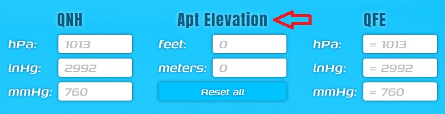
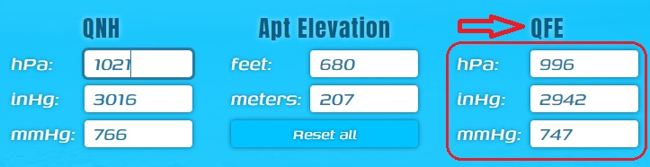

# Qnh To Qfe (pressure calculator)

Hello! I am [Souldrum](https://github.com/souldrum) and this [pressure calculator](https://souldrum.github.io/QnhToQfe_React/) might be useful for you if you like civil aviation simulators like me! Often (especially when there is no ATC on the network) we get weather information from a metar report that lists QNH pressure. However, there are some regions where QFE pressure is still used after the transition height. To calculate it, you need to know the QNH pressure and the elevation of the runway above sea level, and then use certain formulas.

My small application will help reduce the time for calculations. Also, for each of the parameters, an input of all possible units is provided, which will be applied and their values ​​are displayed automatically when filling in any of the parameter windows (for example, if you enter 1013 in the QNH column in the hPa input window, you will automatically see inHg = 2992 and mmHg = 760 ) . And what to do next, I think that it’s not difficult to guess, but still I’ll tell you:

1. To get started, enter the **runway elevation** value in the units you need (for example, I enter 680 feet, the conversion to meters is automatic).

the screen for mobile versions will look like this:

2. Then enter the **QNH** value in the units you need.

3. After that, in the **QFE** column you will immediately see the result.

4. To reset the result, press the **Reset all** button (it can hardly be missed).

### I will be glad if [the calculator](https://souldrum.github.io/QnhToQfe_React/) is useful to you! Enjoy flying in the virtual sky!
